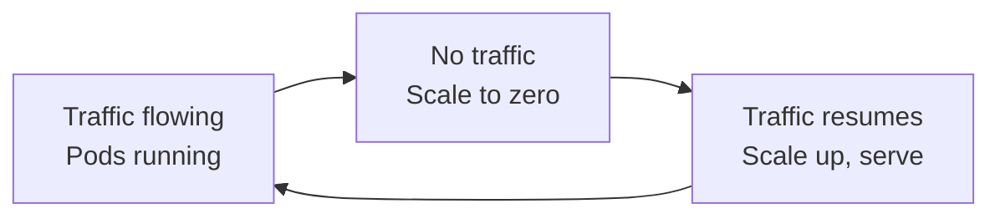
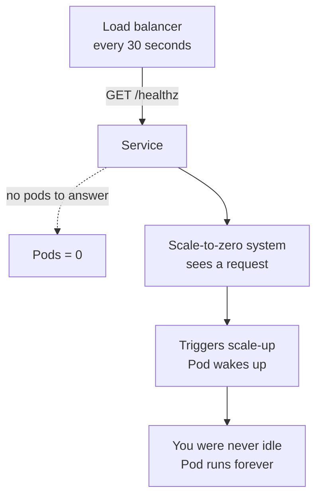
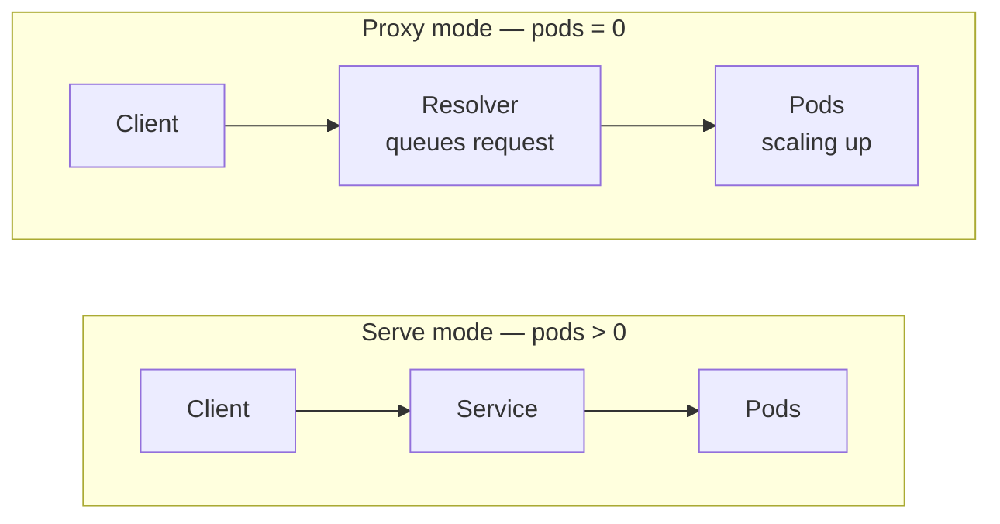
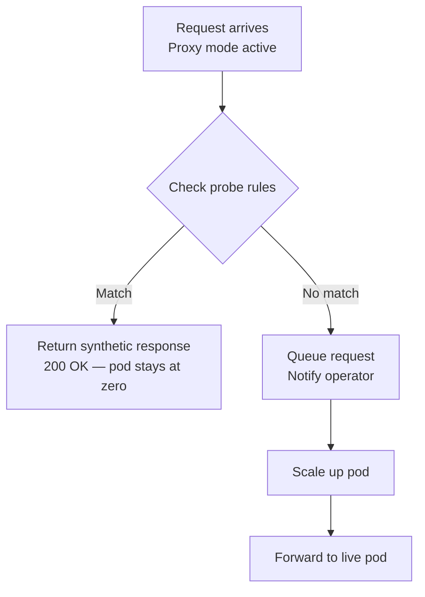

# Your Kubernetes Health Checks Are Accidentally Waking Your Services. Here's the Fix.

Every pod you run costs money. When a service isn't receiving any real user traffic — at 2 AM, over a weekend, between batch jobs — those pods are burning CPU and memory for no reason.

The obvious fix: scale idle services down to zero pods. No pods, no bill.

It works beautifully in staging. Then you try it in production, and something keeps waking your services up.

## The idea: scale services to zero when no traffic is flowing

Kubernetes can run a deployment with zero replicas. If nobody is sending requests to your service, why keep a pod alive? This pattern is called scale-to-zero, and the principle is straightforward — traffic flowing means run pods, no traffic means scale to zero and save money, and when traffic resumes you scale back up and serve the request.



The catch is what happens during that "no traffic" window. Some traffic is always flowing — just not from real users.

---

## The production problem: health checks never stop

In any real Kubernetes environment, your service sits behind a load balancer. Load balancers have one rule: before sending real traffic to an upstream, verify it's alive. They do this by hitting a health check endpoint — typically `GET /healthz` — every 15 to 30 seconds. If the check fails, the upstream is marked down.

This is correct behavior. But it creates a direct conflict with scale-to-zero.



Load balancers aren't the only culprit. Kubernetes liveness probes, service mesh health checks from Istio or Linkerd, and uptime monitors like Prometheus Blackbox Exporter all behave the same way — they hit your service continuously, not because they need your application, but because infrastructure requires constant proof of life.

The result is that services which should be at zero replicas spend most of their time at one replica, responding to infrastructure noise.

---

## KubeElasti: a Kubernetes-native scale-to-zero operator

This is the problem [KubeElasti](https://github.com/KubeElasti/KubeElasti) was built to solve. It adds scale-to-zero to any existing HTTP service — no code changes, no new programming model.

<!-- You define an `ElastiService` resource pointing at your deployment. KubeElasti polls a Prometheus metric to decide when traffic has truly gone idle, then scales your pods to zero. When a real request arrives, a lightweight resolver intercepts it, queues it in memory, triggers scale-up, and forwards it once the pod is ready. The whole process is transparent to the caller. -->

KubeElasti operates in two distinct modes depending on whether pods are running:



This works well for real user requests. But health checks expose a gap: the resolver can't distinguish a `GET /healthz` from a load balancer from a `GET /healthz` from a real user. It sees a request. It scales up. Health checks were the single biggest blocker to teams adopting scale-to-zero in production.

---

## The fix: ProbeResponse

ProbeResponse teaches the resolver to recognize infrastructure probes and answer them directly — without ever waking the workload.

You define matching rules in your `ElastiService`. When a request arrives and the service is at zero replicas, the resolver checks these rules first. A match returns your configured response immediately. No scale-up. The pod stays at zero.

```yaml
probeResponse:
  - method: GET
    path:
      type: PathPrefix
      value: /healthz
    response:
      status: 200
      body: '{"ok":true}'
```

Rules can match on HTTP method, path (exact, prefix, or regex), headers, and query parameters — all ANDed together. First match wins. If nothing matches, normal behavior applies: the request queues and triggers scale-up.



---

## What this means in practice

An important architectural point: ProbeResponse rules only apply when the resolver is active — that is, when your service is at zero replicas. The moment your service has live pods, KubeElasti switches to serve mode and the resolver exits the request path entirely. No overhead, no interception, no latency penalty when traffic is actually flowing.

This matters most for workloads where genuine idle time is expensive to miss: GPU inference pods, enterprise licensed software charged per running instance, and internal developer tools that mostly sit unused between working hours.

## Setting it up

After [installing KubeElasti](https://kubeelasti.dev/src/install/installation/), add a `probeResponse` block to your `ElastiService`. The best first step is to audit your health check sources — your cloud load balancer configuration, Kubernetes ingress annotations, and any uptime monitoring — and create a matching rule for each. For most services, a single `PathPrefix: /health` rule covers everything.

Full configuration reference: [kubeelasti.dev/src/install/configure-elastiservice/#3-proberesponse](https://kubeelasti.dev/src/install/configure-elastiservice/#3-proberesponse)

---

## Key takeaways

Idle services still cost money because health checks keep waking them up. KubeElasti scales pods to zero when real traffic stops and queues requests on the way back up, but health checks were triggering that scale-up even with no real user demand. ProbeResponse returns a configured synthetic response for matched probe paths, keeping pods at zero. And since the resolver only intercepts traffic during proxy mode, there is zero overhead once your pods are running.