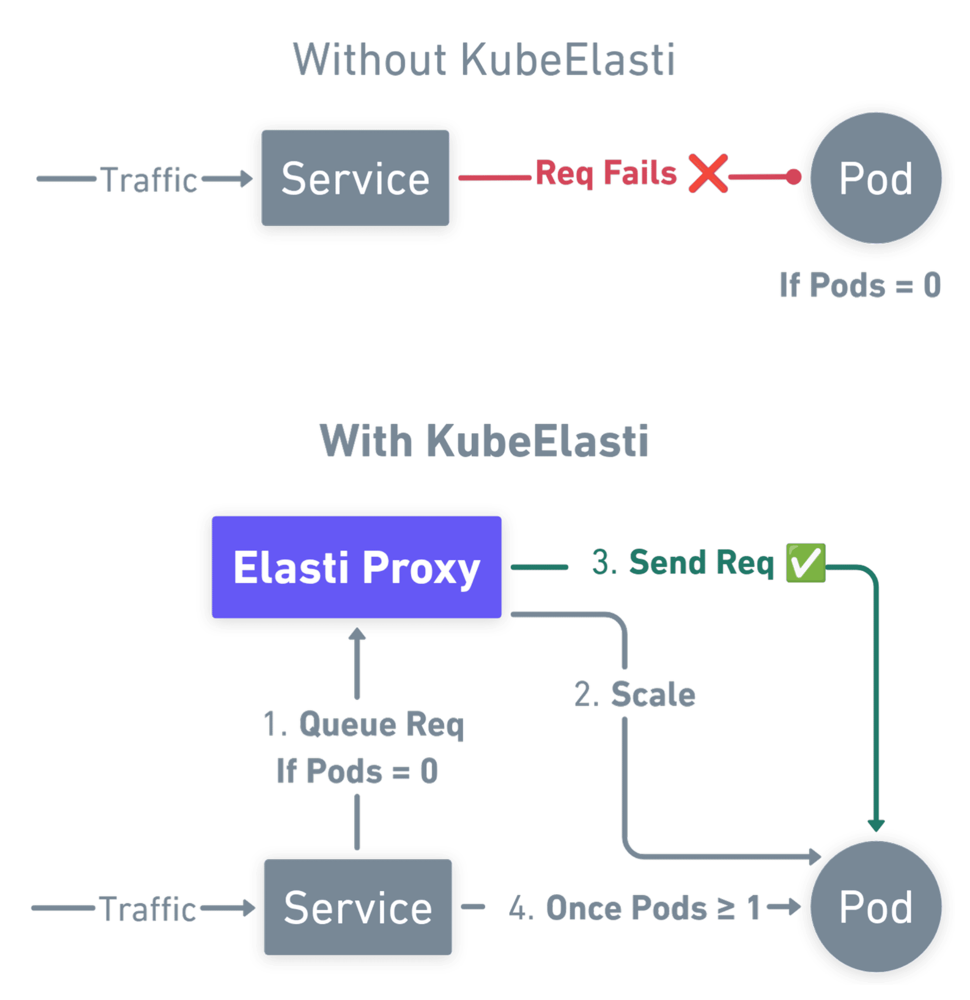
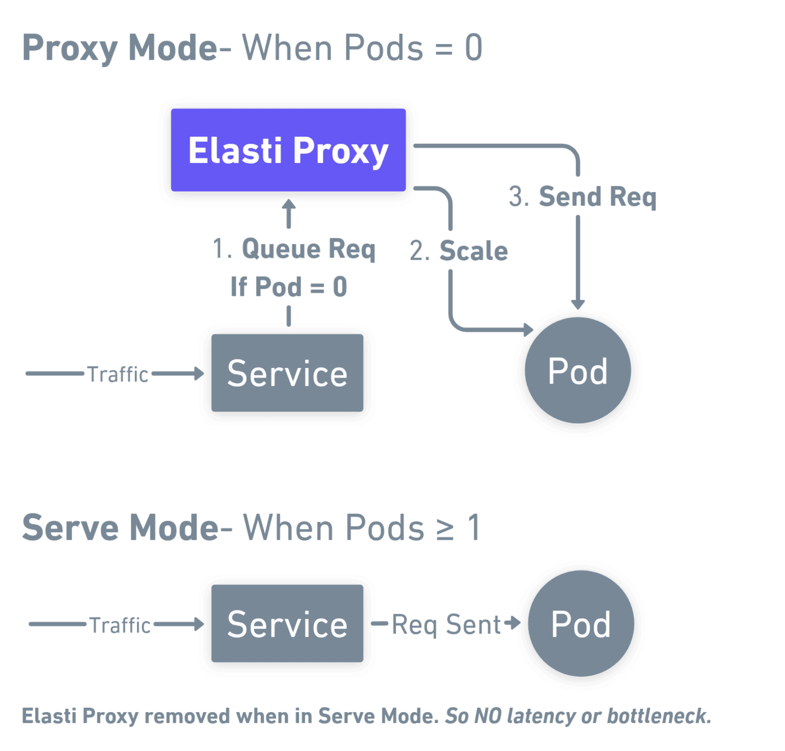

  <section class="landing-hero">
    

      
 CNCF Sandbox · Scale-to-zero for HTTP services

      <h1 class="landing-hero__title">Automatically scale your services to zero when idle and scale up when traffic arrives.</h1>
      

      

        A Kubernetes-native operator that saves cost using scale-to-zero without losing any traffic, requires no code changes, and integrates with your existing Kubernetes infrastructure.
      

      

        <a href="/src/install/installation/" class="md-button md-button--primary">Get started</a>
        <a href="https://slack.cncf.io/" class="md-button" rel="noopener noreferrer">CNCF Slack · #kubeelasti</a>
      

    

    

      
    

  </section>

  

    

      Traffic
      
Queue-aware resolver holds HTTP requests while the first pod comes online.

    

    

      Signals
      
Prometheus queries and thresholds decide when it is safe to scale to zero.

    

    

      Fit
      
Works with the ingress and mesh you already run, no new programming model.

    

  

  <section class="landing-section" aria-labelledby="features-title">
    <header class="landing-section__head">
      
Product

      <h2 class="landing-section__title" id="features-title">Built for real clusters</h2>
      
Scale-to-zero without replacing your ingress, mesh, or workloads.

    </header>
    

      <article class="landing-bento__item landing-bento__item--wide">
        

          <svg viewBox="0 0 24 24" fill="none" stroke="currentColor" stroke-width="2" stroke-linecap="round" stroke-linejoin="round"><path d="M12 2v20M17 5H9.5a3.5 3.5 0 0 0 0 7h5a3.5 3.5 0 0 1 0 7H6"/></svg>
        

        <h3>Save cost</h3>
        
Turn off pods when triggers say the workload is idle. Cooldowns and optional windows keep behaviour predictable.

      </article>
      <article class="landing-bento__item landing-bento__item--wide">
        

          <svg viewBox="0 0 24 24" fill="none" stroke="currentColor" stroke-width="2"><path d="M13 2L3 14h9l-1 8 10-12h-9l1-8z"/></svg>
        

        <h3>Wake path that preserves requests</h3>
        
Proxy mode queues traffic at zero replicas, then hands off to pods in serve mode when ready.

      </article>
      <article class="landing-bento__item">
        

          <svg viewBox="0 0 24 24" fill="none" stroke="currentColor" stroke-width="2"><path d="M14.7 6.3a1 1 0 0 0 0 1.4l1.6 1.6a1 1 0 0 0 1.4 0l3.77-3.77a6 6 0 0 1-7.94 7.94l-6.91 6.91a2.12 2.12 0 0 1-3-3l6.91-6.91a6 6 0 0 1 7.94-7.94l-3.76 3.76z"/></svg>
        

        <h3>One CRD to adopt</h3>
        
<code>ElastiService</code> references your existing Service, Deployment, StatefulSet, or Argo Rollout.

      </article>
      <article class="landing-bento__item">
        

          <svg viewBox="0 0 24 24" fill="none" stroke="currentColor" stroke-width="2"><ellipse cx="12" cy="5" rx="9" ry="3"/><path d="M3 5v14a9 3 0 0 0 18 0V5"/><path d="M3 12a9 3 0 0 0 18 0"/></svg>
        

        <h3>HPA and KEDA friendly</h3>
        
Scale from zero with KubeElasti; let HPA or KEDA own 1→N. Optional KEDA pause keeps ScaledObjects from fighting idle scale.

      </article>
      <article class="landing-bento__item">
        

          <svg viewBox="0 0 24 24" fill="none" stroke="currentColor" stroke-width="2"><path d="M3 3v18h18"/><path d="M18 17V9"/><path d="M13 17V5"/><path d="M8 17v-3"/></svg>
        

        <h3>Observable by default</h3>
        
Prometheus metrics for operator and resolver; wire ServiceMonitors when you enable chart monitoring.

      </article>
      <article class="landing-bento__item landing-bento__item--accent">
        

          <svg viewBox="0 0 24 24" fill="none" stroke="currentColor" stroke-width="2"><path d="M12 22s8-4 8-10V5l-8-3-8 3v7c0 6 8 10 8 10z"/></svg>
        

        <h3>Probe responses at zero replicas</h3>
        
Answer health checks from the resolver so load balancers stay green without forcing a scale-up.

      </article>
    

  </section>

  <section class="landing-section" aria-labelledby="flow-title">
    <header class="landing-section__head">
      
Lifecycle

      <h2 class="landing-section__title" id="flow-title">From steady traffic to cold start</h2>
      
Four beats that match how the controller and resolver cooperate.

    </header>
    

      

        
      

      

        

          
1

          

            <h3>Scale down</h3>
            
When triggers stay under threshold, replicas go to zero and the Service shifts to proxy mode.

          

        

        

          
2

          

            <h3>Queue at the edge</h3>
            
The resolver accepts HTTP, matches optional probe rules, and queues everything else.

          

        

        

          
3

          

            <h3>Scale up</h3>
            
First meaningful request notifies the operator; workloads return to <code>minTargetReplicas</code>.

          

        

        

          
4

          

            <h3>Serve mode</h3>
            
Endpoints point at live pods again; queued work drains and the data path stays direct.

          

        

      

    

  </section>

  <section class="landing-section" aria-labelledby="install-title">
    <header class="landing-section__head">
      
Install

      <h2 class="landing-section__title" id="install-title">Scale-to-zero with just one file</h2>
      
Replace placeholders, apply, then follow the full Helm guide for production defaults.

    </header>
    

      

        

          
          
          
          elasti-service.yaml
        

        <pre><code># Create an ElastiService for the workload you want at zero when idle
# Replace placeholders, then: kubectl apply -f elasti-service.yaml
kubectl apply -f - &lt;&lt;EOF
apiVersion: elasti.truefoundry.com/v1alpha1
kind: ElastiService
metadata:
  name: &lt;TARGET_SERVICE&gt;
  namespace: &lt;TARGET_SERVICE_NAMESPACE&gt;
spec:
  minTargetReplicas: 1
  service: &lt;TARGET_SERVICE_NAME&gt;
  cooldownPeriod: 5
  scaleTargetRef:
    apiVersion: apps/v1
    kind: Deployment
    name: &lt;TARGET_DEPLOYMENT_NAME&gt;
  triggers:
    - type: prometheus
      metadata:
        query: sum(rate(nginx_ingress_controller_requests[1m])) or vector(0)
        serverAddress: http://kube-prometheus-stack-prometheus.monitoring.svc.cluster.local:9090
        threshold: "0.5"
EOF
</code></pre>
      

      

        <a href="/src/install/installation/" class="md-button md-button--primary">Full installation guide</a>
      

    

  </section>

  <section class="landing-section" aria-labelledby="demo-title">
    <header class="landing-section__head">
      
Watch

      <h2 class="landing-section__title" id="demo-title">See KubeElasti in action</h2>
      
Walkthrough of install, triggers, and a live scale-to-zero path.

    </header>
    

      

        <iframe
          src="https://www.loom.com/embed/53b7b524b4c342f99ba44fd5d8104265?sid=c88660d1-a569-470c-8224-b1fffde9a2c6"
          title="KubeElasti demo video"
          allowfullscreen></iframe>
      

    

  </section>

  <section class="landing-section" aria-labelledby="community-title">
    <header class="landing-section__head">
      
Community

      <h2 class="landing-section__title" id="community-title">Build with us</h2>
      
Issues, design notes, and adopters all land in the open.

    </header>
    

      <a class="landing-community__link" href="https://github.com/KubeElasti/KubeElasti" rel="noopener noreferrer">
        
          <svg viewBox="0 0 24 24" fill="currentColor" focusable="false"><path d="M12 .297c-6.63 0-12 5.373-12 12 0 5.303 3.438 9.8 8.205 11.385.6.113.82-.258.82-.577 0-.285-.01-1.04-.01-2.04-3.338.724-4.042-1.61-4.042-1.61C4.422 18.07 3.633 17.7 3.633 17.7c-1.087-.744.084-.729.084-.729 1.205.084 1.838 1.236 1.838 1.236 1.07 1.835 2.809 1.305 3.495.998.108-.775.417-1.305.762-1.605-2.665-.3-5.466-1.332-5.466-5.93 0-1.31.465-2.38 1.235-3.22-.135-.303-.54-1.523.105-3.176 0 0 1.005-.322 3.3 1.23.96-.267 1.98-.399 3-.405 1.02.006 2.04.138 3 .405 2.28-1.552 3.285-1.23 3.285-1.23.645 1.653.24 2.873.12 3.176.765.84 1.23 1.91 1.23 3.22 0 4.61-2.805 5.625-5.475 5.92.42.36.81 1.096.81 2.22 0 1.606-.015 2.896-.015 3.286 0 .315.21.69.825.57A12.034 12.034 0 0 0 24 12.297c0-6.627-5.373-12-12-12"/></svg>
        
        GitHub
      </a>
      <a class="landing-community__link" href="https://slack.cncf.io/" rel="noopener noreferrer">
        
          <svg class="landing-community__icon-svg--slack" xmlns="http://www.w3.org/2000/svg" viewBox="0 0 270 270" fill="currentColor" focusable="false">
            <g>
              <g>
                <path d="M99.4,151.2c0,7.1-5.8,12.9-12.9,12.9s-12.9-5.8-12.9-12.9c0-7.1,5.8-12.9,12.9-12.9h12.9V151.2z"/>
                <path d="M105.9,151.2c0-7.1,5.8-12.9,12.9-12.9s12.9,5.8,12.9,12.9v32.3c0,7.1-5.8,12.9-12.9,12.9s-12.9-5.8-12.9-12.9C105.9,183.5,105.9,151.2,105.9,151.2z"/>
              </g>
              <g>
                <path d="M118.8,99.4c-7.1,0-12.9-5.8-12.9-12.9s5.8-12.9,12.9-12.9s12.9,5.8,12.9,12.9v12.9H118.8z"/>
                <path d="M118.8,105.9c7.1,0,12.9,5.8,12.9,12.9s-5.8,12.9-12.9,12.9H86.5c-7.1,0-12.9-5.8-12.9-12.9s5.8-12.9,12.9-12.9C86.5,105.9,118.8,105.9,118.8,105.9z"/>
              </g>
              <g>
                <path d="M170.6,118.8c0-7.1,5.8-12.9,12.9-12.9c7.1,0,12.9,5.8,12.9,12.9s-5.8,12.9-12.9,12.9h-12.9V118.8z"/>
                <path d="M164.1,118.8c0,7.1-5.8,12.9-12.9,12.9c-7.1,0-12.9-5.8-12.9-12.9V86.5c0-7.1,5.8-12.9,12.9-12.9c7.1,0,12.9,5.8,12.9,12.9V118.8z"/>
              </g>
              <g>
                <path d="M151.2,170.6c7.1,0,12.9,5.8,12.9,12.9c0,7.1-5.8,12.9-12.9,12.9c-7.1,0-12.9-5.8-12.9-12.9v-12.9H151.2z"/>
                <path d="M151.2,164.1c-7.1,0-12.9-5.8-12.9-12.9c0-7.1,5.8-12.9,12.9-12.9h32.3c7.1,0,12.9,5.8,12.9,12.9c0,7.1-5.8,12.9-12.9,12.9H151.2z"/>
              </g>
            </g>
          </svg>
        
        CNCF Slack
      </a>
      <a class="landing-community__link" href="https://github.com/KubeElasti/KubeElasti/issues" rel="noopener noreferrer">
        
        <svg xmlns="http://www.w3.org/2000/svg" width="28" height="28" viewBox="0 0 24 24" fill="none" stroke="currentColor" stroke-width="2" stroke-linecap="round" stroke-linejoin="round"><path d="m8 2 1.88 1.88"/><path d="M14.12 3.88 16 2"/><path d="M9 7.13v-1a3.003 3.003 0 1 1 6 0v1"/><path d="M12 20c-3.3 0-6-2.7-6-6v-3a4 4 0 0 1 4-4h4a4 4 0 0 1 4 4v3c0 3.3-2.7 6-6 6"/><path d="M12 20v-9"/><path d="M6.53 9C4.6 8.75 3 6.77 3 4.5 3 2.6 5.02 1 7.5 1c1.22 0 2.4.45 3.3 1.2"/><path d="M17.47 9c1.93-.25 3.53-2.23 3.53-4.5C21 2.6 18.98 1 16.5 1c-1.22 0-2.4.45-3.3 1.2"/></svg>
        
        Report an issue
      </a>
    

  </section>

  

    <h2>Ready to optimize your Kubernetes workloads?</h2>
    <a href="/src/install/installation/" class="md-button md-button--primary">Get started with KubeElasti</a>
  

  

    
Project status

    <h2>We are a Cloud Native Computing Foundation sandbox project.</h2>
    
KubeElasti was originally created by TrueFoundry.

    
KubeElasti is developed in the open with community discussions, issues, and pull requests in the project repository.

    

      
    

  

  