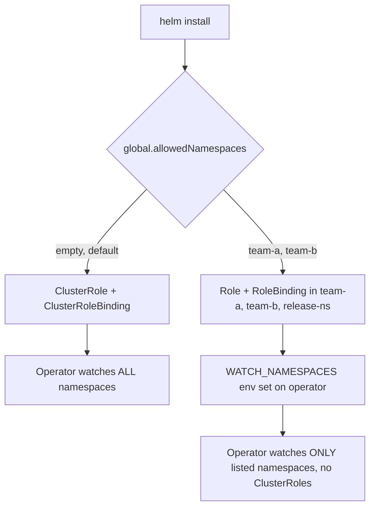

# Namespace-scoped install

## What it is

By default KubeElasti installs cluster-scoped: a `ClusterRole` and `ClusterRoleBinding` let the operator and resolver watch every namespace.

Namespace-scoped mode is opt-in. You give KubeElasti an explicit list of namespaces. It then installs a `Role` and `RoleBinding` in each one instead of a `ClusterRole`, and the operator only watches those namespaces. There is no cluster-wide list/watch.

## When to use it

- Multi-tenant clusters where a team may only touch its own namespaces.
- Regulated or restricted environments that forbid cluster-wide RBAC.
- You want KubeElasti's blast radius limited to a known set of namespaces.

Use the default cluster-scoped install if none of these apply.

## Prerequisite: install the CRD

Creating a CRD is always a cluster-scoped operation. By default the chart installs the `ElastiService` CRD as part of the release, so a namespace-only install would fail on that step.

A cluster admin installs the CRD once, out of band. Render it from the chart so it matches the release version:

```bash
helm template elasti oci://ghcr.io/kubeelasti/charts/elasti \
  --show-only templates/elastiservice-crd.yaml | kubectl apply -f -
```

After the CRD exists, a tenant with permission only in its own namespaces installs the chart with `global.installCRD=false` (below).

!!! warning "Operator image version"
    Namespace-scoped mode needs an operator image that supports the `WATCH_NAMESPACES` env var. Use a release that ships this feature. On an older image the chart still renders scoped RBAC, but the operator falls back to cluster-scoped watching and its reads fail under the namespaced `Role`.

## Enable it

Set `global.allowedNamespaces` to the namespaces you want KubeElasti to manage, and turn off CRD install (the admin already applied it):

```bash
helm install elasti oci://ghcr.io/kubeelasti/charts/elasti \
  --namespace elasti --create-namespace \
  --set global.installCRD=false \
  --set 'global.allowedNamespaces={team-a,team-b}'
```

If your credentials can manage CRDs, leave `global.installCRD` at its default (`true`) and skip the admin step above.

The release namespace is always added to the list automatically. The operator needs it for the leader-election lease and to read the resolver's `EndpointSlices`.

Leaving `global.allowedNamespaces` empty (the default) keeps the cluster-scoped install unchanged.

## What changes

| | Default (`[]`) | Scoped (list set) |
|---|---|---|
| Operator/resolver RBAC | `ClusterRole` + `ClusterRoleBinding` | `Role` + `RoleBinding` per namespace (+ release namespace) |
| Watched scope | all namespaces | only the listed namespaces |
| Operator env | none | `WATCH_NAMESPACES` |
| ClusterRoles created | yes | none |



## Verify

No `ClusterRole` or `ClusterRoleBinding` is created in scoped mode:

```bash
kubectl get clusterrole,clusterrolebinding -l app.kubernetes.io/instance=elasti
# expect: no resources found
```

A `Role` and `RoleBinding` exist in each listed namespace:

```bash
kubectl get role,rolebinding -n team-a -l app.kubernetes.io/instance=elasti
```

The operator has the namespace list:

```bash
kubectl get deploy -n elasti -l app.kubernetes.io/component=operator \
  -o jsonpath='{.items[0].spec.template.spec.containers[0].env}' | grep WATCH_NAMESPACES
```

An `ElastiService` created in a namespace outside the list is ignored by the operator.

## Uninstall

Same as the default install. Remove ElastiServices first, then the release:

```bash
kubectl delete elastiservices --all
helm uninstall elasti -n elasti
```

The CRD, installed separately by an admin, is removed separately:

```bash
kubectl delete crd elastiservices.elasti.truefoundry.com
```
